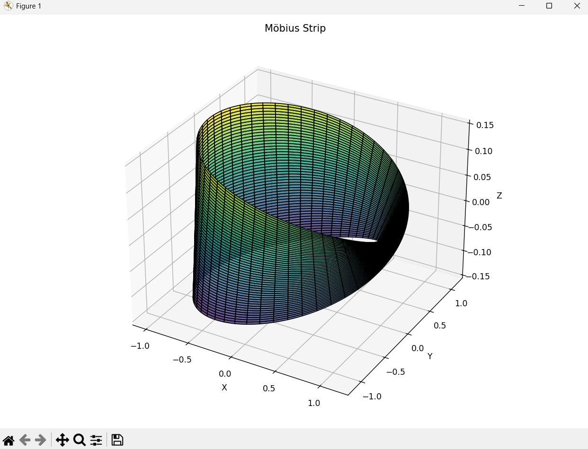

# Möbius Strip Modeling – Report

##  Overview

This project involved creating a Python script to model a **Möbius strip** using parametric equations and compute its geometric properties, including **surface area** and **edge length**. The task required both mathematical understanding and numerical implementation, along with **3D visualization** of the resulting surface.

---

##  Code Structure

The script is organized around a class named `MobiusStrip` to keep the code modular and easy to maintain. Here's a breakdown of its components:

- **Initialization (`__init__`)**  
  Accepts the radius `R`, strip width `w`, and resolution `n` as parameters. It also sets up 2D mesh grids for the parametric variables `u` and `v`.

- **Surface Generation (`generate_surface`)**  
  Implements the parametric equations of a Möbius strip to generate 3D coordinates `(x, y, z)` across the mesh grid.

- **Surface Area Computation (`compute_surface_area`)**  
  Uses numerical integration to approximate the surface area. It calculates partial derivatives of the surface coordinates and uses the magnitude of the cross product to estimate differential surface elements, which are integrated using Simpson’s rule.

- **Edge Length Computation (`compute_edge_length`)**  
  Approximates the length of the boundary by summing distances between points along the edges of the strip (`v = -w/2` and `v = +w/2`).

- **3D Visualization (`plot`)**  
  Renders the Möbius strip using Matplotlib’s 3D plotting tools, with appropriate coloring and perspective to highlight its geometry.

---

##  Surface Area Approximation

To compute the surface area, the script applies the following steps:

1. **Partial Derivatives**  
   The script estimates the partial derivatives of the parametric surface with respect to `u` and `v` using `numpy.gradient`.

2. **Cross Product**  
   The magnitude of the cross product of the partial derivatives gives the **differential area element** at each grid point.

3. **Numerical Integration**  
   These area elements are integrated over the domain using the `simpson` method from `scipy.integrate`, which applies **Simpson’s rule** for accurate approximation.

This method is well-suited to surfaces defined by parametric equations and avoids the complexity of analytical integration over a twisted non-orientable surface.

---

##  Challenges Faced

- A key challenge was understanding the **mathematical and geometric properties** of a Möbius strip. I had to research how a Möbius strip is defined parametrically and how its **non-orientable surface** affects mesh generation and area calculation.

- Another challenge was learning about **Simpson’s rule** and how it is applied in numerical integration, especially in two dimensions. I initially encountered an error using `simps` and later discovered that the correct method in newer versions of SciPy is `simpson`.

- Implementing **3D visualization** was also non-trivial. I needed to explore how to properly render a Möbius strip with correct orientation, lighting, and perspective. Understanding how to map the parametric surface to a visual plot was a learning experience in itself.

---

##  Conclusion

This project provided hands-on experience with:

- **Parametric 3D modeling**
- **Numerical geometry**
- **Scientific visualization**

It was both mathematically and programmatically enriching, giving deeper insights into how mathematical objects like the Möbius strip can be represented and analyzed computationally.

---

##  Technologies Used

- Python 3
- NumPy
- SciPy
- Matplotlib

  ---

  ##  Plot
  

